# User Manual

This section is aimed at **non‑technical users** who want to learn how to use **Urbano Libre** to obtain routes with real‑time or historical weather conditions.

## What can you do?

- Check the weather along the route.  
- Choose any date and time you want to analyse.  
- Display alerts with the current weather status.

---

## Desktop usage examples

### 1&nbsp;–&nbsp;Create a route step by step

When the app starts you’ll see a **sidebar** on the left and a large **interactive map** on the right.

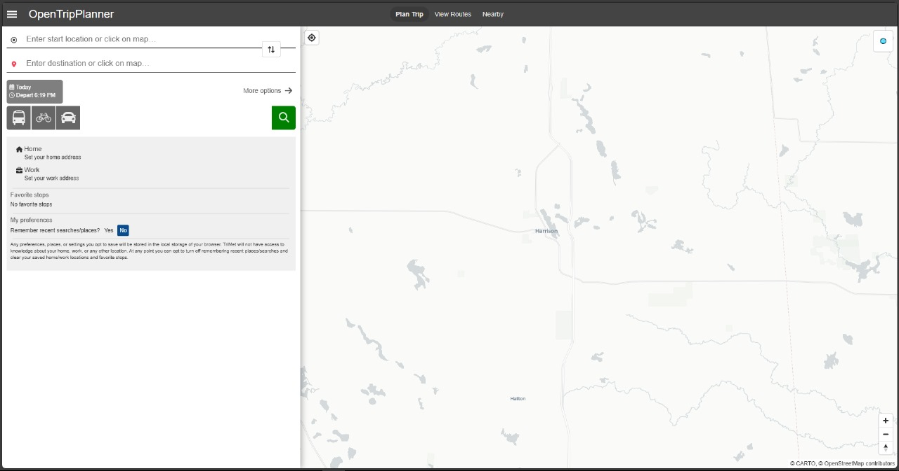

!!! tip "Explore the map"
    Hold the left (or right) mouse button and drag to move the map.

- **Origin**  
Right‑click the desired location and choose **“From here”**.

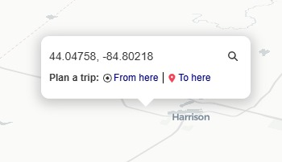

- **Destination**  
Repeat and pick **“To here”**.

!!! info "Manual input"
    A form in the upper‑left corner lets you enter **coordinates** directly.  
    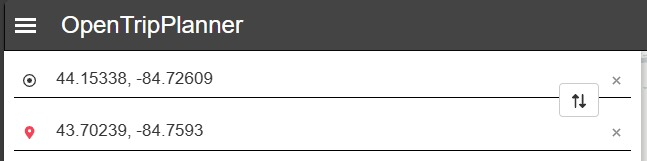

Climate **cards** appear for both points.

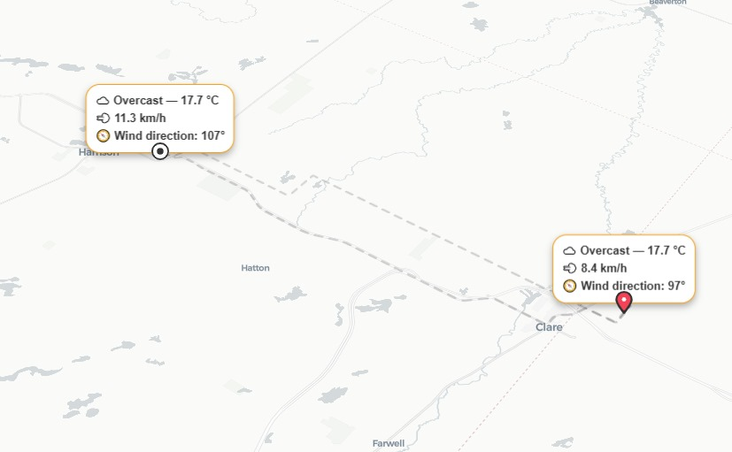

Select the **travel mode** you want to inspect.

Pick the itinerary that best suits you.

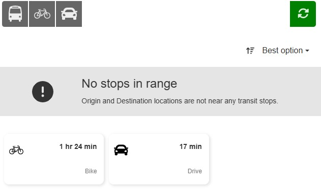

!!! warning
    Not every requested itinerary may be available; it depends on the planner settings.

The detailed view shows the route and —for **bike** or **walk** modes— a message advising whether it’s safe according to the weather.

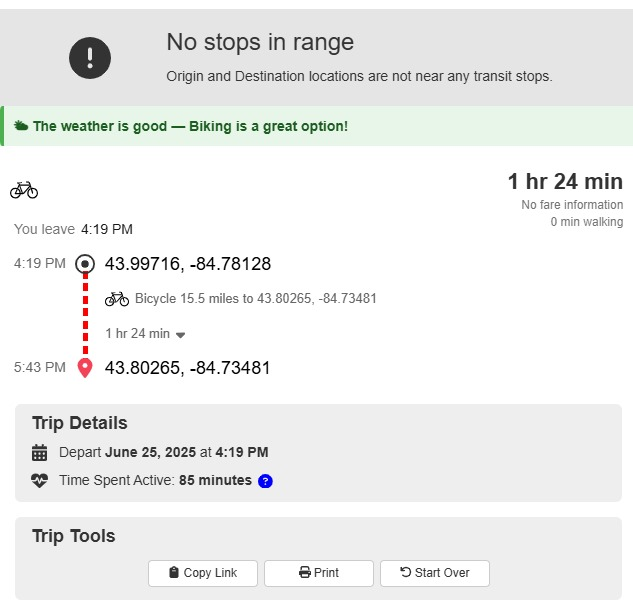

With an active itinerary, additional cards are created along the path.

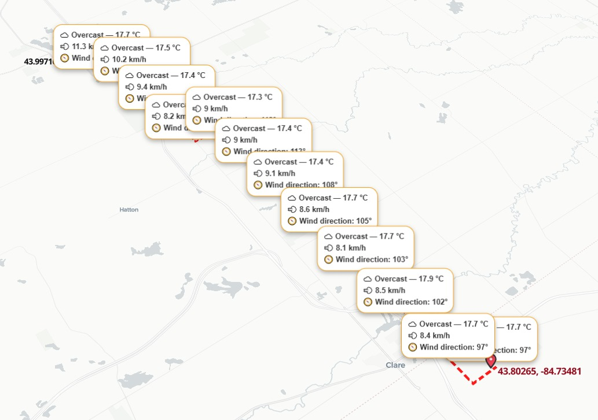

---

### 2&nbsp;–&nbsp;Change date and time

Click the **📅 button** at the top‑right corner.

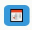

Choose the day and hour to view the weather at that moment.  
Planning is available **up to 14 days ahead**; you can also inspect past dates.

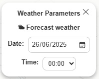

---

### 3&nbsp;–&nbsp;Card information

Each card has **three possible states**:

| State | Example |
|-------|---------|
| Weather found | 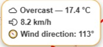 |
| Searching |  |
| No data | 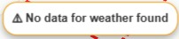 |

Field description:

1. **General weather** — May display  
   ☀️ Clear sky / 🌤 Partly cloudy / ☁️ Overcast / 🌫 Fog / 🌦 Drizzle / 🌧 Rain / ❄️ Snow / ⛈ Thunderstorm / 🔍 Unknown
2. **Temperature** (°C).
3. **Wind speed** (km /h).
4. **Wind direction** (degrees).

---

## Frequently asked questions

**What if no weather data is available?**  
You might be requesting information beyond the **14‑day limit** or the Open‑Meteo API has no data for that area.

**Why don’t I see markers?**  
Check your internet connection. If the issue persists, the third‑party Open‑Meteo service may be temporarily unavailable.