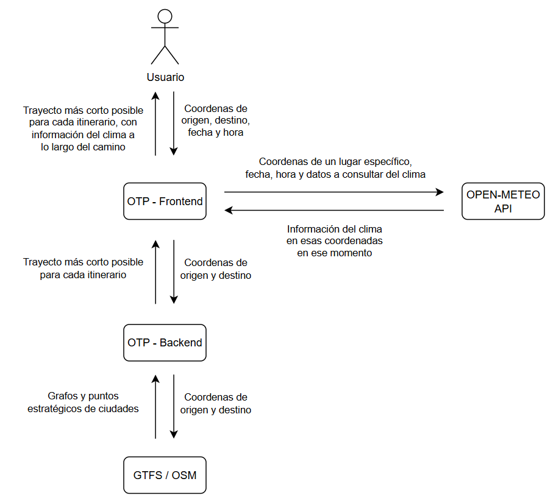

# Urbano Libre – Weather‑aware Trip Planning

Urbano Libre augments **OpenTripPlanner** with real‑time and forecast
weather data obtained from **Open‑Meteo**.  
Alerts (rain, strong wind, storms) are displayed **along the route**, inside
the itinerary panel and directly on the map.

---

## Why we built it

1. **User safety** – suggest safer modes when weather turns adverse.  
2. **Planning accuracy** – allow travellers to change departure time
   if rain is predicted mid‑trip.  
3. **Open stack** – OTP 2 + Open‑Meteo are both open‑source and free.

---

## High‑level Architecture

| Layer | Component | Responsibility |
|-------|-----------|----------------|
| Frontend | `otp-react-redux` fork | Map, itinerary UI, weather overlays |
| Data‑access | Weather middleware | Calls Open‑Meteo `forecast` or `archive` |
| Backend | OTP 2.7 container | Builds multimodal itineraries from GTFS/OSM |
| External API | **Open‑Meteo** | JSON hourly weather data |

--- 

## Core user stories

| ID | Story | Weather behaviour |
|----|-------|-------------------|
| U‑01 | *As a cyclist I want to avoid rain on my commute* | If any leg mode is `BICYCLE` **and** `weathercode ≥ 60`, UI shows “⚠ Rain – consider transit” |
| U‑02 | *As a walker I want wind alerts* | Wind 45 km/h insideare shown on the card |
| U‑03 | *As a planner I want to inspect weather at arbitrary date/time* | Global clock lets the user query past (archive) or next 7 days (forecast) |
